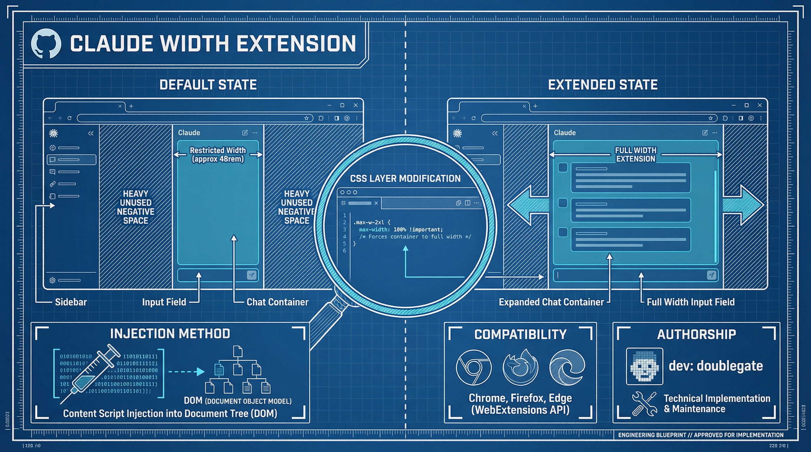

# Claude Chat Width Customizer

**Version 1.9.1** | Firefox Extension (Manifest V2)

A Firefox extension that allows you to customize the width of the chat interface on [claude.ai](https://claude.ai). Features configuration profiles, Firefox Sync integration, enhanced styling options, and comprehensive accessibility support.


## Features

- **Adjustable Width**: Set chat width from 40% to 100% of the viewport
- **Quick Presets**: One-click buttons for Narrow (50%), Medium (70%), Wide (85%), and Full (100%) widths
- **Custom Presets**: Create up to 4 custom presets with your favorite widths, drag-and-drop reordering, and favorites marking
- **Configuration Profiles** (v1.9.0): Create up to 8 named profiles (Work, Personal, etc.) with distinct settings
- **Browser Sync** (v1.9.0): Sync profiles across browsers with Firefox Sync, with local fallback
- **Import/Export** (v1.9.0): Backup settings to JSON, import from JSON, reset to factory defaults
- **Context Menu**: Right-click on claude.ai pages to quickly access all presets
- **Recently Used**: Quick access to your last 3 used widths
- **Enhanced Styling** (v1.8.0): Advanced typography, display modes, code block controls, and visual tweaks
- **Keyboard Shortcuts**: Global shortcuts for power users (Alt+Shift+W/C/D), popup shortcuts (1-4, R, Esc)
- **Full Accessibility**: ARIA labels, focus management, screen reader announcements, reduced motion support
- **Real-time Preview**: See changes instantly as you adjust the slider
- **Theme Support**: Light, Dark, and System theme modes for the extension popup
- **Toolbar Badge**: Current width percentage displayed in the browser toolbar icon
- **Persistent Settings**: Your preferences (width, theme, custom presets, profiles) are saved and applied to all Claude sessions
- **Main Window Only**: Modifies only the main chat area, leaving the sidebar untouched
- **SPA Compatible**: Works seamlessly with Claude's single-page application navigation
- **Security Hardened**: Content Security Policy (CSP) enforced, no unsafe DOM operations
- **Mozilla Add-ons Compliant**: Includes required `data_collection_permissions` declaration
- **Developer Tooling** (v1.9.1): ESLint v9.x, Vitest test suite (281 tests), pre-commit hooks with Husky


## Installation

### Temporary Installation (Development/Testing)

1. Open Firefox and navigate to `about:debugging`
2. Click on **"This Firefox"** in the left sidebar
3. Click **"Load Temporary Add-on..."**
4. Navigate to the extension folder and select `manifest.json`
5. The extension will be loaded and active until you restart Firefox

### Permanent Installation

1. Package the extension as a `.xpi` file (see Building section)
2. Navigate to `about:addons` in Firefox
3. Click the gear icon ⚙️ and select **"Install Add-on From File..."**
4. Select the `.xpi` file

### Building the XPI Package

```bash
# Navigate to the extension directory
cd claude-width-extension

# Create the XPI file (ZIP with .xpi extension)
zip -r build/claude-width-customizer-v1.9.1.xpi . \
  -x "*.git*" -x "build/*" -x "*.DS_Store" -x "CLAUDE.md" \
  -x ".claude/*" -x "docs/*" -x "images/*" -x "tests/*" \
  -x "node_modules/*" -x "coverage/*" -x "*.config.js" \
  -x ".husky/*" -x "package*.json"
```

## Usage

1. Navigate to [claude.ai](https://claude.ai)
2. Click the extension icon in the Firefox toolbar
3. Use the slider or preset buttons to select your desired width
4. Changes apply immediately to all open Claude tabs

### Controls

| Control | Description |
|---------|-------------|
| **Theme Toggle** | Switch between Light, Dark, or System theme |
| **Slider** | Drag to set width between 40-100% |
| **Narrow** | Sets width to 50% |
| **Medium** | Sets width to 70% |
| **Wide** | Sets width to 85% |
| **Full** | Sets width to 100% |
| **Save Current** | Save current width as a custom preset |
| **Reset** | Returns to default 85% width |
| **Apply** | Manually saves and applies current setting |
| **Advanced Styling** | Toggle advanced typography, display modes, and visual tweaks |

### Custom Presets

Create your own presets for quick access to your preferred widths:

1. Adjust the slider to your desired width
2. Click **"Save Current"** in the Custom Presets section
3. Enter a name (e.g., "Reading Mode", "Code Review")
4. Click **Save** to create the preset

**Preset Management:**
- **Edit**: Click the edit button to rename or change the width
- **Delete**: Remove presets you no longer need
- **Reorder**: Drag presets or use Alt+Arrow keys to reorder
- **Favorite**: Star your most-used presets for quick access

### Context Menu

Right-click anywhere on claude.ai pages to access the **Claude Width** context menu with all your presets.

### Keyboard Shortcuts

**Global Shortcuts** (work anywhere when browser is focused):

| Shortcut | Action |
|----------|--------|
| `Alt+Shift+W` | Open extension popup |
| `Alt+Shift+C` | Cycle through presets (50% -> 70% -> 85% -> 100% -> 50%...) |
| `Alt+Shift+D` | Toggle between current width and default (85%) |

**Popup Shortcuts** (when popup is open):

| Shortcut | Action |
|----------|--------|
| `1` | Narrow preset (50%) |
| `2` | Medium preset (70%) |
| `3` | Wide preset (85%) |
| `4` | Full width (100%) |
| `R` | Reset to default |
| `Escape` | Close popup |
| `Tab` | Navigate between controls |
| `Alt+Up/Down` | Reorder custom presets |

Note: Global shortcuts can be customized via `about:addons` > gear icon > "Manage Extension Shortcuts"

### Configuration Profiles

Create profiles to save different configurations for different use cases:

1. Click the profile dropdown in the popup header
2. Select **"New Profile..."** to create a profile
3. Name your profile (e.g., "Work", "Reading", "Code Review")
4. Each profile stores all settings: width, theme, custom presets, and styling options

**Profile Management:**
- **Switch Profiles**: Use the dropdown in the popup header
- **Edit/Delete**: Go to Options page (gear icon) > Profiles section
- **Duplicate**: Create a copy of an existing profile as a starting point
- **Sync**: Enable Firefox Sync to share profiles across browsers

### Import/Export Settings

Backup your settings or transfer them to another browser:

1. Open the Options page (gear icon in popup)
2. Scroll to **Data Management** section
3. **Export**: Click "Export Settings" to download a JSON file
4. **Import**: Click "Import Settings" and select a previously exported file
5. **Reset**: Use "Reset to Factory Defaults" to start fresh

## Development

### Prerequisites

- Node.js 20.19.0 or later
- npm (comes with Node.js)
- Firefox browser for testing

### Setup

```bash
# Clone the repository
git clone https://github.com/doublegate/claude-width-extension.git
cd claude-width-extension

# Install development dependencies
npm install
```

### Available Scripts

| Command | Description |
|---------|-------------|
| `npm test` | Run all 281 tests with Vitest |
| `npm run test:watch` | Run tests in watch mode during development |
| `npm run test:coverage` | Generate code coverage report |
| `npm run test:ui` | Open Vitest UI for interactive testing |
| `npm run lint` | Check code for ESLint issues |
| `npm run lint:fix` | Automatically fix ESLint issues |
| `npm run check` | Syntax check all JavaScript files |

### Pre-commit Hooks

The project uses Husky and lint-staged to automatically run ESLint on staged JavaScript files before each commit. This ensures code quality standards are maintained.

### Testing in Firefox

1. Open Firefox and navigate to `about:debugging`
2. Click **"This Firefox"**
3. Click **"Load Temporary Add-on..."**
4. Select `manifest.json` from the project root
5. Make changes and click "Reload" to test updates

## File Structure

```
claude-width-extension/
├── manifest.json           # Extension manifest (Manifest V2, v1.9.1)
├── README.md               # This documentation
├── CONTRIBUTING.md         # Contribution guidelines
├── LICENSE                 # MIT license
├── package.json            # Node.js project config (dev dependencies)
├── package-lock.json       # Dependency lock file
├── eslint.config.js        # ESLint v9.x flat configuration
├── vitest.config.js        # Vitest test framework configuration
├── .husky/                 # Git hooks for pre-commit linting
├── icons/
│   ├── icon.svg            # Source vector icon
│   ├── icon-48.png         # Toolbar icon (48px)
│   ├── icon-96.png         # High-DPI toolbar icon (96px)
│   └── icon-256.png        # Mozilla Add-ons listing icon (256px)
├── lib/
│   ├── constants.js        # Shared constants (loaded first by all scripts)
│   └── profiles.js         # Profile management utilities (v1.9.0)
├── background/
│   └── background.js       # Background script for keyboard commands, badge, context menu
├── content/
│   ├── content.js          # Content script injected into claude.ai
│   └── content.css         # Base styles and transitions
├── options/
│   ├── options.html        # Options/settings page (profiles, sync, import/export)
│   ├── options.css         # Options page styling
│   └── options.js          # Options page logic
├── popup/
│   ├── popup.html          # Popup interface HTML
│   ├── popup.css           # Popup styling (themes, drag-drop, modal)
│   └── popup.js            # Popup interaction logic (presets CRUD, drag-drop)
├── tests/
│   ├── setup.js            # Test environment setup
│   ├── mocks/
│   │   └── browser.js      # Mock browser APIs for testing
│   ├── constants.test.js   # Tests for lib/constants.js
│   ├── profiles.test.js    # Tests for lib/profiles.js (75 tests)
│   ├── popup.test.js       # Tests for popup functionality
│   ├── content.test.js     # Tests for content script
│   ├── background.test.js  # Tests for background script
│   └── integration.test.js # Cross-module integration tests
├── docs/
│   ├── ROADMAP.md              # Development roadmap
│   └── MANIFEST-V3-MIGRATION.md # Future migration guide
└── build/
    └── *.xpi               # Built packages (gitignored)
```

## Architecture Overview



## Technical Details

### Permissions

- `storage`: Persists user preferences (local and sync storage for Firefox Sync)
- `activeTab`: Detects when user is on claude.ai
- `tabs`: Required for updating badge when switching tabs
- `contextMenus`: Provides right-click menu access to presets
- `downloads`: Enables settings export to JSON file

### How It Works

1. **Content Script**: Injected into all claude.ai pages, the content script generates and injects CSS rules that override Claude's default max-width constraints on chat containers.

2. **Popup Interface**: Provides a slider-based UI for width selection. Changes are saved to `browser.storage.local` and immediately communicated to all open Claude tabs.

3. **CSS Targeting**: Uses multiple CSS selectors to target conversation containers, message bubbles, and the input composer. The `!important` flag is used where necessary to override React-generated inline styles.

4. **MutationObserver**: Watches for DOM changes to ensure styles persist through SPA navigation events.

### Browser Compatibility

- **Firefox**: 142.0+ (required for Firefox Sync storage API)
- **Firefox ESR**: Not supported (requires Firefox 142+)
- **Chrome/Edge**: Would require Manifest V3 migration (see `docs/MANIFEST-V3-MIGRATION.md`)

## Troubleshooting

### Extension Not Working

1. Ensure you're on `https://claude.ai/*`
2. Try refreshing the page
3. Check that the extension is enabled in `about:addons`
4. Look for errors in the Browser Console (Ctrl+Shift+J)

### Width Not Applying

Claude.ai uses highly specific CSS selectors that may change. If the extension stops working after a Claude UI update:

1. Open Developer Tools (F12)
2. Inspect the chat container elements
3. Note the new class names
4. Update selectors in `content/content.js`

### Sidebar Affected

The extension specifically excludes sidebar elements using CSS selectors like `[class*="Sidebar"]`, `nav`, and `aside`. If the sidebar width changes, please report the issue.

## Contributing

Contributions are welcome! Please see [CONTRIBUTING.md](CONTRIBUTING.md) for detailed guidelines.

**Quick Start:**

1. Fork the repository
2. Clone and install dependencies: `npm install`
3. Create a feature branch: `git checkout -b feature/my-feature`
4. Make changes and ensure tests pass: `npm test`
5. Lint your code: `npm run lint`
6. Commit with clear messages (pre-commit hooks run automatically)
7. Submit a pull request

## License

MIT License - feel free to modify and distribute.

## Author

DoubleGate - [GitHub](https://github.com/doublegate)

## Changelog

See [CHANGELOG.md](CHANGELOG.md) for the complete version history.
